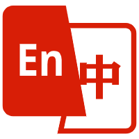

<!-- 
════════════════════════════════════════════════════════════
  StrokeGuardian AI · README Hero (single-logo | fully-polished)
═════════════════════════════════════════════════════════════════
-->

<!-- ——— Language Switch (top-right) ——— -->
<!-- ========= Language Switch ========= -->

  <a href="README.zh-CN.md"
     title="Switch to Simplified Chinese"
     style="
       display:inline-flex;
       align-items:center;
       gap:6px;
       padding:4px 10px 4px 8px;
       font:600 13px/1 'Segoe UI',Roboto,'Helvetica Neue',Arial,sans-serif;
       color:#fff;
       background:#00a9ff;
       border-radius:6px;
       text-decoration:none;
       box-shadow:0 1px 2px rgba(0,0,0,.15);
     ">
    <!-- 你的图标，可是 flag / 地球 / logo —— 建议 24×24 PNG/SVG -->
    
    简体中文
  </a>

<!-- ——— Logo ——— -->

  

<!-- ——— Badge Row ——— -->

  <!-- Release -->
  

  <!-- License -->
  

  <!-- CI -->
  

  <!-- Maintenance -->
  

<!-- ——— Title & Tagline ——— -->
<h1 align="center" style="margin:0.4em 0 0.2em 0;">
  StrokeGuardian&nbsp;AI
</h1>

  <i><small>✨ AI-powered · Clinical-grade · Real-time & Precision Stroke-Rehabilitation Assessment Platform ✨</small></i>

<!-- ——— abstract ——— -->

  An edge-to-cloud system that transforms everyday movements into standardised, traceable rehabilitation metrics—empowering clinicians with data-driven decisions and researchers with an end-to-end, high-fidelity data loop.

<!-- ——— A B S T R A C T ——— --> 
<h2 id="abstract" align="center" style="margin:2.2em 0 0.7em;color:#0084ff;">Abstract</h2>

  <strong>StrokeGuardian AI</strong> leverages <kbd>up to 7 channels of multi-angle RGB-D and Inertial Measurement Units (IMUs)</kbd> to construct a high-precision dense frustum on the <em>edge side</em>. Initially, it applies <kbd>single-dual viewpoint pose estimation</kbd> for multi-view data fusion, followed by <kbd>Spatio-Temporal Transformer-VAE</kbd> in conjunction with <kbd>ICP (Iterative Closest Point)/Bundle Adjustment</kbd> to achieve sub-millimeter accuracy in 3D skeletal reconstruction. This design balances joint angle reliability (ICC ≥ 0.94) with end-to-end latency (< 50 ms).  
  Subsequently, the system employs a <kbd>Bayesian state-space</kbd> framework alongside <kbd>factor graphs</kbd> to interpret high-dimensional kinematic feature vectors, generating ICF (International Classification of Functioning, Disability and Health)-aligned biomarkers—such as gait symmetry, power spectral entropy, and synergy coupling indices—at intervals of <em>16 ms</em>. These metrics are encrypted via <kbd>gRPC-TLS</kbd> and mapped to <abbr title="HL7 Fast Healthcare Interoperability Resources">FHIR</abbr> resources, ensuring interoperability and clinical integration.  
  Furthermore, an embedded <kbd>GPT-4 Turbo</kbd> model (enhanced by RAG and Prompt Ensembling) synthesizes electronic medical records (EMR), clinical guidelines, and patient preferences to dynamically produce individualized training prescriptions, predictive risk scores, and adherence summaries in natural language. Complemented by <kbd>LSTM-Survival</kbd> and <kbd>XGB-SHAP</kbd> algorithms for fall and recurrent stroke threshold alerts, the platform delivers timely and reliable decision support in critical clinical workflows, advancing a more systematic approach to stroke rehabilitation assessment and intervention.

 

<!-- ——— Key Metrics ——— -->
<h2 id="key-metrics" align="center" style="margin:2em 0 0.7em;color:#0084ff;">Key Metrics</h2>

<table align="center" style="margin:1.3em auto;font-size:14.5px;">
  <tr>
    <td align="center">👥 Multi-Center Prospective Cohort</td>
    <td><b>N&nbsp;=&nbsp;312</b></td>
    <td align="center">🔗 NIHSS Correlation</td>
    <td><b>r&nbsp;=&nbsp;0.83</b></td>
  </tr>
  <tr>
    <td align="center">⏱️ Reduction in Follow-up Time</td>
    <td><b>-38% <i>(p&nbsp;&lt;&nbsp;0.001)</i></b></td>
    <td align="center">⚙️ DevOps</td>
    <td>Helm&nbsp;Chart • GitHub&nbsp;Actions • CNCF&nbsp;Compliance</td>
  </tr>
</table>

  In a multi-center prospective cohort (<b>N=312</b>), the system demonstrated a strong correlation (<b>r=0.83</b>) with the
  NIHSS (<em>National Institutes of Health Stroke Scale</em>), indicating high accuracy and consistency in quantifying clinical
  functional deficits.   
  Additionally, follow-up times were reduced by <b>38%</b> (<i>p&lt;0.001</i>), underscoring StrokeGuardian AI’s efficacy in
  improving rehabilitation efficiency and mitigating clinical workload. For streamlined deployment and maintenance, the platform
  utilizes automated DevOps tools such as <b>Helm Chart</b> and <b>GitHub Actions</b>, along with a <b>CNCF</b>-compliant
  containerized microservices architecture—ensuring scalability, adaptability, and compliance for broader clinical implementation.

 

<!-- ——— Feature Matrix  ——— -->
<h2 id="feature-matrix" align="center" style="margin:2em 0 0.7em;color:#0084ff;">Feature Matrix</h2>

  <ul>
    <li>
      <b>Multi-View 3-D Re-targeting:</b>
      Integrates data from up to seven cameras and IMUs,
      dynamically compensating for occlusions and reconstructing precise 3D skeletal representations
      to facilitate high-resolution kinematic and physiological analyses.
    </li>
    <li>
      <b>Real-Time Stream of Metrics:</b>
      Delivers inference results at up to 60 Hz via
      <kbd>WebSocket</kbd> and <kbd>gRPC</kbd>,
      ensuring secure, zero-copy data transmission with minimal latency
      for time-sensitive clinical environments.
    </li>
    <li>
      <b>LLM-Based Semantic Reasoning:</b>
      Employs Retrieval-Augmented Generation (RAG) and Prompt Ensembling
      to produce evidence-based rehabilitation prescriptions and pharmacological alerts
      tailored to individual patient profiles.
    </li>
    <li>
      <b>Prediction &amp; Early Warning:</b>
      Leverages the <kbd>LSTM-Survival</kbd> model to forecast risks of falls and recurrent stroke,
      issuing instant alerts upon threshold exceedance,
      thereby enabling proactive and timely clinical interventions.
    </li>
    <li>
      <b>Data Governance:</b>
      Maps multi-dimensional metrics into FHIR resources,
      aggregates them in a centralized Data Lake,
      and adopts <kbd>OpenTelemetry</kbd> and <kbd>Prometheus</kbd>
      for full-stack observability and compliance auditing.
    </li>
    <li>
      <b>Progressive DevOps:</b>
      Utilizes containerized microservices on <kbd>Kubernetes</kbd>
      with blue-green deployment (< 5 minutes) and comprehensive audit trails,
      offering robust support for rapid iteration and regulatory compliance.
    </li>
  </ul>

  By integrating <kbd>explainable AI</kbd>, <kbd>cloud-edge hybrid computing</kbd>,
  and <kbd>LLM-driven natural language reporting</kbd>,
  StrokeGuardian AI seamlessly unifies bedside observation, remote follow-up, and research analytics,
  forming a scalable foundation for “Precision Rehabilitation 4.0.”
  The platform’s modular architecture and standardized data interfaces not only facilitate broad-scale deployment
  and clinical translation but also provide comprehensive and forward-looking support
  for stroke rehabilitation assessment, personalized intervention, and large-scale longitudinal studies.

